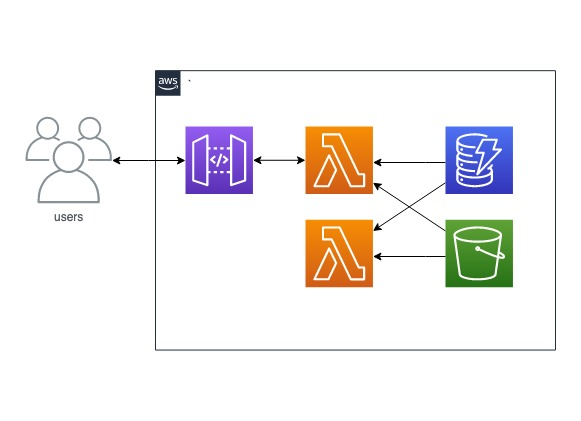

# coupon
## 概要

小売店向けのクーポン配信用アプリのWebAPIです。

HTTP/GETでクーポンの以下の情報が取得できます。

取得できるデータは以下です。
- クーポンの画像
- クーポンのQRコード画像
- クーポンデータ
    - ID：7桁ゼロ埋め数値（例：0001245）
    - タイトル：20文字以内の文字列（例：【秋葉原店】全商品 10% OFF！）
    - 説明文：100文字以内の文字列（例：ご利用一回限り。他のクーポンとの併用はできません。クーポンをご利用いただいた場合、ポイントはつきません)

クーポンのタイトルで指定ワード検索をすることができます。

## タスク
https://trello.com/b/pW2NSlUH/coupon


## Dynamo

|Key|Value|
|---|---|
|0000001|{title:'hogehoge',description:'fugafuga',start:'2019-01-01T00:00:00',end:'2019-01-01T23:59:59'}|

## S3

```
root
  |_0000001_coupon.png
  |_0000001_qrcode.jpg
```

## APIGateway

[Swagger](./swagger.yaml)参照