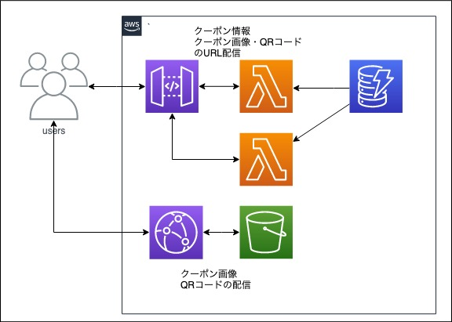

# coupon
## 概要


小売店向けのクーポン配信用アプリのWebAPIです。

HTTP/GETでクーポンの以下の情報が取得できます。

取得できるデータは以下です。
- クーポンの画像
- クーポンのQRコード画像
- クーポンデータ
    - ID：7桁ゼロ埋め数値（例：0001245）
    - タイトル：20文字以内の文字列（例：【秋葉原店】全商品 10% OFF！）
    - 説明文：100文字以内の文字列（例：ご利用一回限り。他のクーポンとの併用はできません。クーポンをご利用いただいた場合、ポイントはつきません)

クーポンのタイトルで指定ワード検索をすることができます。

## タスク
https://trello.com/b/pW2NSlUH/coupon

## 設計

- S3に画像ファイルを格納し、CloudFrontで配信します。
- DynamoDBにクーポンの各種情報を格納し、画像ファイルのホスティングURLも格納します。
- RESTAPIは一覧取得、指定タイトルでの検索、詳細出力です。
- APIでは画像のホスティングURLを返却します。

### Dynamo

|Hashkey|GSI|Value|
|---|---|---|---|
|id: '0000001'|title: 'hogehoge'|description:'fugafuga', thumnail_url: 'https://**/image.png',qrcode_url: 'https://**/qrcode.jpg'|

### S3

```
root
  |_0000001_coupon.png
  |_0000001_qrcode.jpg
```

### APIGateway

[Swagger](./swagger.yaml)参照

#### MEMO

- 構成管理はAWS-CDKを利用しました。
- 理由は単純に使ってみたかったから
- LambdaつくるだけならSAMやServerlessFrameworkのほうがハマリポイントは少なかった気がします。
- リソース作成については、S3+CloudFrontのSPA構成が簡単にできて感動しました。
- CDKでACMの証明書取得でuseast-1の取得がうまくできず、結局手動でやりました。
- まともにTypeScript書いたのは初めてでしたが、CDK+TypeScriptはCFnとくらべると書きやすかったです。
- ハンドラのテスト時、DynamoをMockにしてテストしてましたが、Dynamoをほぼそのまま返していたので
Validationのテストくらいにしかなってないような気がしてます。
- 結局クエリ系のテストは手動でやりました。

##### 懸念
- 課題の例文に利用一回限り〜とあったので、これも仕様なのかものすごい悩みましたが、
考えた結果配信側ではどうしようもないと結論づけて画像はホスティングしました。
- 画像ファイルのサイズ制限も考え、CloudFrontでの配信にしましたが、QRコードの画像程度なら1MB制限に引っかからなさそうなので
base64でAPI経由の配信を強制してもよかったかもしれません。
- 署名付きURL発行も考えましたが、結局固定QRCodeなので意味がないのではと考えてやめました。
- 店舗IDや有効期限による検索も考えましたが、あまり作業時間がとれず断念しました。

##### 聞きたいこと
- Dynamoのページングってわりと一般的にやるものなんでしょうか？
いままでページングしなきゃいけないほど、巨大なリソースを扱うことがなかったので
